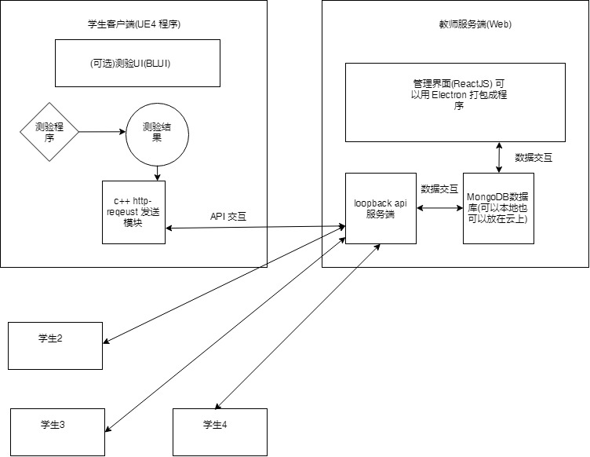
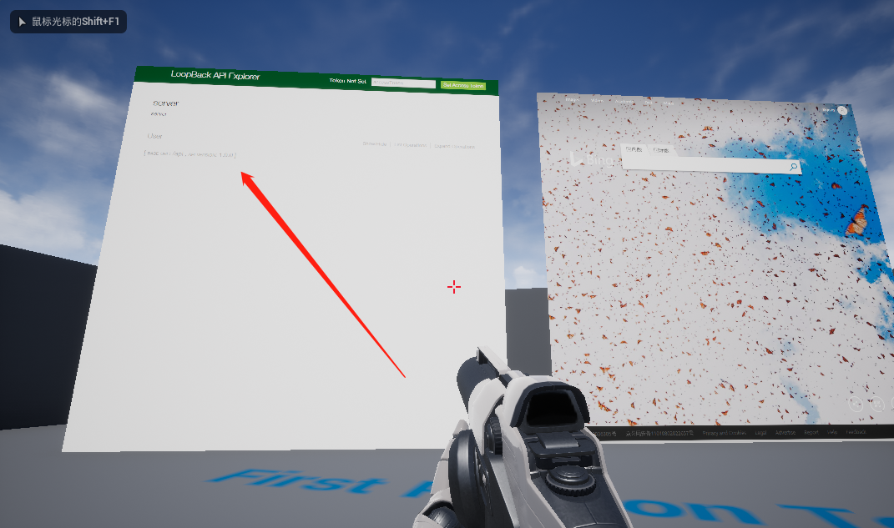

#### 
#### client目录>UE4 客户端 4.17
#### server目录>Loopback api 服务端

#### loopback 3.0 安装:
#### https://loopback.io/doc/en/lb3/Installation.html

#### UE4 HTML WEB UI - BLUI for UE4 4.17
#### Github: https://github.com/AaronShea/BLUI
#### Release: https://github.com/getnamo/BLUI/releases

#### 

#### 如何发送HTTP request:
#### https://wiki.unrealengine.com/Http-requests
